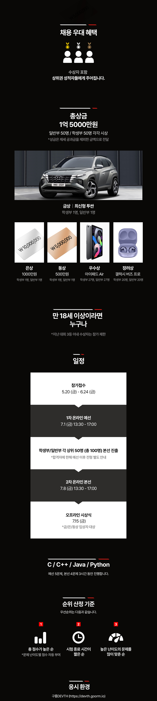

# 현대 모비스 알고리즘 경진대회

- 주소: https://hyundaimobis.goorm.io/assessment/31303/22-현대모비스-알고리즘-경진대회

- 응시환경: https://devth-preview.goorm.io/exam/53763/devth-preview-kor/quiz/1

- 일정:
  - 접수: 05.20.~06.24.
  - 온라인 예선: 07.01.(금) 13:30~17:00
  - 온라인 본선: 07.08.(금) 13:30~17:00
  - 오프라인 시상식: 07.15.(금)

- 문제:
  - c/c++/java/python
  - 예전 5문
  - 본선 4문

