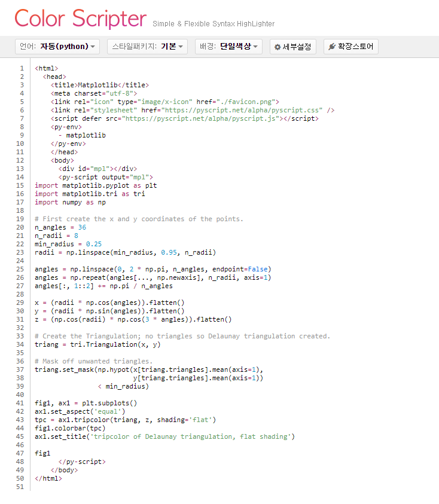
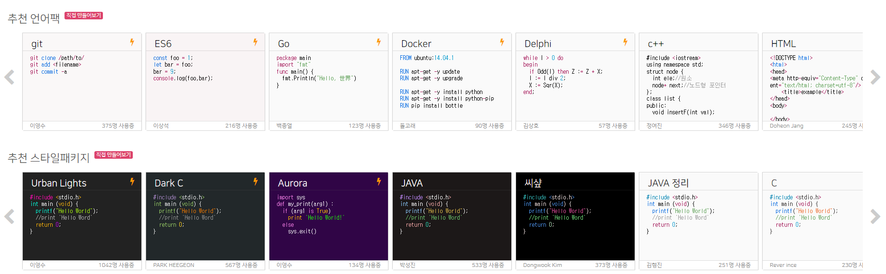
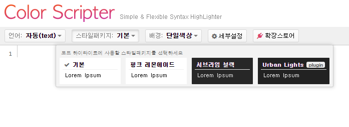

# 포스팅 할때 코드를 예쁘게 작성하게 도와주는 사이트
## Color Scripter

주소: https://colorscripter.com/

- md파일의 코드를 포스팅 할때, 로컬에서 작업했을 때와 티스토리에서 게시했을때 모습이 달라지는 일이 생기는데 
- colorscripter는 코드블록이 아니라 html과 css를 사용하여 코드를 표기해주기 때문에 더 깔끔하고 읽기 쉬운 코드가 된다.
- 예를들어 
~~~
<html>
  <head>
    <title>Matplotlib</title>
    <meta charset="utf-8">
    <link rel="icon" type="image/x-icon" href="./favicon.png">
    <link rel="stylesheet" href="https://pyscript.net/alpha/pyscript.css" />
    
    <py-env>
      - matplotlib
    </py-env>
    </head>
    <body>
      

      <py-script output="mpl">
import matplotlib.pyplot as plt
import matplotlib.tri as tri
import numpy as np

# First create the x and y coordinates of the points.
n_angles = 36
n_radii = 8
min_radius = 0.25
radii = np.linspace(min_radius, 0.95, n_radii)

angles = np.linspace(0, 2 * np.pi, n_angles, endpoint=False)
angles = np.repeat(angles[..., np.newaxis], n_radii, axis=1)
angles[:, 1::2] += np.pi / n_angles

x = (radii * np.cos(angles)).flatten()
y = (radii * np.sin(angles)).flatten()
z = (np.cos(radii) * np.cos(3 * angles)).flatten()

# Create the Triangulation; no triangles so Delaunay triangulation created.
triang = tri.Triangulation(x, y)

# Mask off unwanted triangles.
triang.set_mask(np.hypot(x[triang.triangles].mean(axis=1),
                         y[triang.triangles].mean(axis=1))
                < min_radius)

fig1, ax1 = plt.subplots()
ax1.set_aspect('equal')
tpc = ax1.tripcolor(triang, z, shading='flat')
fig1.colorbar(tpc)
ax1.set_title('tripcolor of Delaunay triangulation, flat shading')

fig1
      </py-script>
    </body>
</html>

~~~
코드블록으로는 위와같이 표기되는 코드들이 
아래와 같이 파이스크립트 예제의 코드를 작성하고 나서 html로 복사 버튼을 누르게되면
 

아래와 같이 변환된다.

<table class="colorscripter-code-table" style="margin:0;padding:0;border:none;background-color:#fafafa;border-radius:4px;" cellspacing="0" cellpadding="0"><tr><td style="padding:6px;border-right:2px solid #e5e5e5">

1

2

3

4

5

6

7

8

9

10

11

12

13

14

15

16

17

18

19

20

21

22

23

24

25

26

27

28

29

30

31

32

33

34

35

36

37

38

39

40

41

42

43

44

45

46

47

48

49

50

51

</td><td style="padding:6px 0;text-align:left">

&lt;html&gt;

&nbsp;&nbsp;&lt;head&gt;

&nbsp;&nbsp;&nbsp;&nbsp;&lt;title&gt;Matplotlib&lt;/title&gt;

&nbsp;&nbsp;&nbsp;&nbsp;&lt;meta&nbsp;charset="utf-8"&gt;

&nbsp;&nbsp;&nbsp;&nbsp;&lt;link&nbsp;rel="icon"&nbsp;type="image/x-icon"&nbsp;href="./favicon.png"&gt;

&nbsp;&nbsp;&nbsp;&nbsp;&lt;link&nbsp;rel="stylesheet"&nbsp;href="https://pyscript.net/alpha/pyscript.css"&nbsp;/&gt;

&nbsp;&nbsp;&nbsp;&nbsp;&lt;script&nbsp;defer&nbsp;src="https://pyscript.net/alpha/pyscript.js"&gt;&lt;/script&gt;

&nbsp;&nbsp;&nbsp;&nbsp;&lt;py-env&gt;

&nbsp;&nbsp;&nbsp;&nbsp;&nbsp;&nbsp;-&nbsp;matplotlib

&nbsp;&nbsp;&nbsp;&nbsp;&lt;/py-env&gt;

&nbsp;&nbsp;&nbsp;&nbsp;&lt;/head&gt;

&nbsp;&nbsp;&nbsp;&nbsp;&lt;body&gt;

&nbsp;&nbsp;&nbsp;&nbsp;&nbsp;&nbsp;&lt;div&nbsp;id="mpl"&gt;&lt;/div&gt;

&nbsp;&nbsp;&nbsp;&nbsp;&nbsp;&nbsp;&lt;py-script&nbsp;output="mpl"&gt;

import&nbsp;matplotlib.pyplot&nbsp;as&nbsp;plt

import&nbsp;matplotlib.tri&nbsp;as&nbsp;tri

import&nbsp;numpy&nbsp;as&nbsp;np

&nbsp;

#&nbsp;First&nbsp;create&nbsp;the&nbsp;x&nbsp;and&nbsp;y&nbsp;coordinates&nbsp;of&nbsp;the&nbsp;points.

n_angles&nbsp;=&nbsp;36

n_radii&nbsp;=&nbsp;8

min_radius&nbsp;=&nbsp;0.25

radii&nbsp;=&nbsp;np.linspace(min_radius,&nbsp;0.95,&nbsp;n_radii)

&nbsp;

angles&nbsp;=&nbsp;np.linspace(0,&nbsp;2&nbsp;*&nbsp;np.pi,&nbsp;n_angles,&nbsp;endpoint=False)

angles&nbsp;=&nbsp;np.repeat(angles[...,&nbsp;np.newaxis],&nbsp;n_radii,&nbsp;axis=1)

angles[:,&nbsp;1::2]&nbsp;+=&nbsp;np.pi&nbsp;/&nbsp;n_angles

&nbsp;

x&nbsp;=&nbsp;(radii&nbsp;*&nbsp;np.cos(angles)).flatten()

y&nbsp;=&nbsp;(radii&nbsp;*&nbsp;np.sin(angles)).flatten()

z&nbsp;=&nbsp;(np.cos(radii)&nbsp;*&nbsp;np.cos(3&nbsp;*&nbsp;angles)).flatten()

&nbsp;

#&nbsp;Create&nbsp;the&nbsp;Triangulation;&nbsp;no&nbsp;triangles&nbsp;so&nbsp;Delaunay&nbsp;triangulation&nbsp;created.

triang&nbsp;=&nbsp;tri.Triangulation(x,&nbsp;y)

&nbsp;

#&nbsp;Mask&nbsp;off&nbsp;unwanted&nbsp;triangles.

triang.set_mask(np.hypot(x[triang.triangles].mean(axis=1),

&nbsp;&nbsp;&nbsp;&nbsp;&nbsp;&nbsp;&nbsp;&nbsp;&nbsp;&nbsp;&nbsp;&nbsp;&nbsp;&nbsp;&nbsp;&nbsp;&nbsp;&nbsp;&nbsp;&nbsp;&nbsp;&nbsp;&nbsp;&nbsp;&nbsp;y[triang.triangles].mean(axis=1))

&nbsp;&nbsp;&nbsp;&nbsp;&nbsp;&nbsp;&nbsp;&nbsp;&nbsp;&nbsp;&nbsp;&nbsp;&nbsp;&nbsp;&nbsp;&nbsp;&lt;&nbsp;min_radius)

&nbsp;

fig1,&nbsp;ax1&nbsp;=&nbsp;plt.subplots()

ax1.set_aspect('equal')

tpc&nbsp;=&nbsp;ax1.tripcolor(triang,&nbsp;z,&nbsp;shading='flat')

fig1.colorbar(tpc)

ax1.set_title('tripcolor&nbsp;of&nbsp;Delaunay&nbsp;triangulation,&nbsp;flat&nbsp;shading')

&nbsp;

fig1

&nbsp;&nbsp;&nbsp;&nbsp;&nbsp;&nbsp;&lt;/py-script&gt;

&nbsp;&nbsp;&nbsp;&nbsp;&lt;/body&gt;

&lt;/html&gt;

&nbsp;

<a href="http://colorscripter.com/info#e" target="_blank" style="color:#e5e5e5text-decoration:none">Colored by Color Scripter</a>
</td><td style="vertical-align:bottom;padding:0 2px 4px 0"><a href="http://colorscripter.com/info#e" target="_blank" style="text-decoration:none;color:white">cs</a></td></tr></table>

- 하이라이트도 적용되고, 줄수가 표기되어 코드가 길어질때도 가독성을 유지할 수 있다.

- 확장스토어: https://extends.colorscripter.com/#/
확장스토어에 들어가면 어러가지 언어팩이나 스타일패키지를 사용할 수 있는데

이중에 Urban Lights를 추천한다.
클릭만 하면 바로 적용할 수 있고,

다시 https://colorscripter.com/에서 스타일패키지를 선택하면 

과같이 새로운 스타일 패키지를 사용할 수 있다.

적용하면 아래와 같이 표기된다.

<table class="colorscripter-code-table" style="margin:0;padding:0;border:none;background-color:#222222;border-radius:4px;" cellspacing="0" cellpadding="0"><tr><td style="padding:6px;border-right:2px solid #4f4f4f">

1

2

3

4

5

6

7

8

9

10

11

12

13

14

15

16

17

18

19

20

21

22

23

24

25

26

27

28

29

30

31

32

33

34

35

36

37

38

39

40

41

42

43

44

45

46

47

48

49

50

51

</td><td style="padding:6px 0;text-align:left">

&lt;html&gt;

&nbsp;&nbsp;&lt;head&gt;

&nbsp;&nbsp;&nbsp;&nbsp;&lt;title&gt;Matplotlib&lt;/title&gt;

&nbsp;&nbsp;&nbsp;&nbsp;&lt;meta&nbsp;charset="utf-8"&gt;

&nbsp;&nbsp;&nbsp;&nbsp;&lt;link&nbsp;rel="icon"&nbsp;type="image/x-icon"&nbsp;href="./favicon.png"&gt;

&nbsp;&nbsp;&nbsp;&nbsp;&lt;link&nbsp;rel="stylesheet"&nbsp;href="https://pyscript.net/alpha/pyscript.css"&nbsp;/&gt;

&nbsp;&nbsp;&nbsp;&nbsp;&lt;script&nbsp;defer&nbsp;src="https://pyscript.net/alpha/pyscript.js"&gt;&lt;/script&gt;

&nbsp;&nbsp;&nbsp;&nbsp;&lt;py-env&gt;

&nbsp;&nbsp;&nbsp;&nbsp;&nbsp;&nbsp;-&nbsp;matplotlib

&nbsp;&nbsp;&nbsp;&nbsp;&lt;/py-env&gt;

&nbsp;&nbsp;&nbsp;&nbsp;&lt;/head&gt;

&nbsp;&nbsp;&nbsp;&nbsp;&lt;body&gt;

&nbsp;&nbsp;&nbsp;&nbsp;&nbsp;&nbsp;&lt;div&nbsp;id="mpl"&gt;&lt;/div&gt;

&nbsp;&nbsp;&nbsp;&nbsp;&nbsp;&nbsp;&lt;py-script&nbsp;output="mpl"&gt;

import&nbsp;matplotlib.pyplot&nbsp;as&nbsp;plt

import&nbsp;matplotlib.tri&nbsp;as&nbsp;tri

import&nbsp;numpy&nbsp;as&nbsp;np

&nbsp;

#&nbsp;First&nbsp;create&nbsp;the&nbsp;x&nbsp;and&nbsp;y&nbsp;coordinates&nbsp;of&nbsp;the&nbsp;points.

n_angles&nbsp;=&nbsp;36

n_radii&nbsp;=&nbsp;8

min_radius&nbsp;=&nbsp;0.25

radii&nbsp;=&nbsp;np.linspace(min_radius,&nbsp;0.95,&nbsp;n_radii)

&nbsp;

angles&nbsp;=&nbsp;np.linspace(0,&nbsp;2&nbsp;*&nbsp;np.pi,&nbsp;n_angles,&nbsp;endpoint=False)

angles&nbsp;=&nbsp;np.repeat(angles[...,&nbsp;np.newaxis],&nbsp;n_radii,&nbsp;axis=1)

angles[:,&nbsp;1::2]&nbsp;+=&nbsp;np.pi&nbsp;/&nbsp;n_angles

&nbsp;

x&nbsp;=&nbsp;(radii&nbsp;*&nbsp;np.cos(angles)).flatten()

y&nbsp;=&nbsp;(radii&nbsp;*&nbsp;np.sin(angles)).flatten()

z&nbsp;=&nbsp;(np.cos(radii)&nbsp;*&nbsp;np.cos(3&nbsp;*&nbsp;angles)).flatten()

&nbsp;

#&nbsp;Create&nbsp;the&nbsp;Triangulation;&nbsp;no&nbsp;triangles&nbsp;so&nbsp;Delaunay&nbsp;triangulation&nbsp;created.

triang&nbsp;=&nbsp;tri.Triangulation(x,&nbsp;y)

&nbsp;

#&nbsp;Mask&nbsp;off&nbsp;unwanted&nbsp;triangles.

triang.set_mask(np.hypot(x[triang.triangles].mean(axis=1),

&nbsp;&nbsp;&nbsp;&nbsp;&nbsp;&nbsp;&nbsp;&nbsp;&nbsp;&nbsp;&nbsp;&nbsp;&nbsp;&nbsp;&nbsp;&nbsp;&nbsp;&nbsp;&nbsp;&nbsp;&nbsp;&nbsp;&nbsp;&nbsp;&nbsp;y[triang.triangles].mean(axis=1))

&nbsp;&nbsp;&nbsp;&nbsp;&nbsp;&nbsp;&nbsp;&nbsp;&nbsp;&nbsp;&nbsp;&nbsp;&nbsp;&nbsp;&nbsp;&nbsp;&lt;&nbsp;min_radius)

&nbsp;

fig1,&nbsp;ax1&nbsp;=&nbsp;plt.subplots()

ax1.set_aspect('equal')

tpc&nbsp;=&nbsp;ax1.tripcolor(triang,&nbsp;z,&nbsp;shading='flat')

fig1.colorbar(tpc)

ax1.set_title('tripcolor&nbsp;of&nbsp;Delaunay&nbsp;triangulation,&nbsp;flat&nbsp;shading')

&nbsp;

fig1

&nbsp;&nbsp;&nbsp;&nbsp;&nbsp;&nbsp;&lt;/py-script&gt;

&nbsp;&nbsp;&nbsp;&nbsp;&lt;/body&gt;

&lt;/html&gt;

&nbsp;

<a href="http://colorscripter.com/info#e" target="_blank" style="color:#4f4f4ftext-decoration:none">Colored by Color Scripter</a>
</td><td style="vertical-align:bottom;padding:0 2px 4px 0"><a href="http://colorscripter.com/info#e" target="_blank" style="text-decoration:none;color:white">cs</a></td></tr></table>
