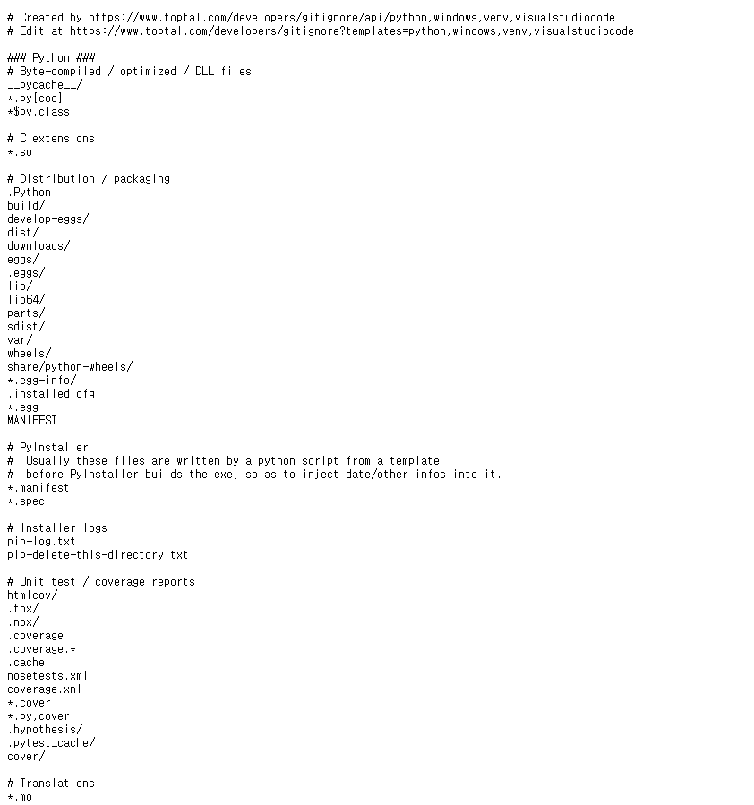
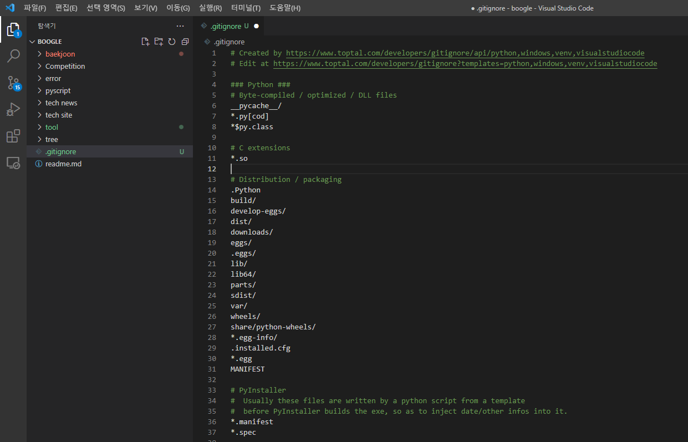

# .gitignore 파일 , gitignore.io에서 간단히 생성하기

> ## 개발자들은 자신의 일을 줄이기 위해 서비스를 만듭니다.
 

주소: https://www.toptal.com/developers/gitignore

.gitignore 파일은 git을 통해 파일을 관리할 때 대부분 사용하는 파일입니다.

1. 프로젝트의 최상단 폴더에 생성하여
2. 로컬에서 git으로 올리고 싶지 않은 파일의 목록을 작성하면
3. 목록은 git add 과정에서 무시되어 git에 올라가지 않게됩니다.

나만 보기 위해 작성한 문서, 자동으로 생성되는 파일들 등이 포함되는데, 
이를 프로젝트마다 매번 작성하는 것은 번거로운 일입니다. 

따라서 .gitignore에 자주 작성되는 
- 운영체제
- 개발환경(IDE)
- 프로그래밍 언어
는 입력만 하면 gitignore에 작성될 형식의 텍스트 형식으로 반환해 줍니다.

예를 들어,

위와 같이 홈페이지에서 자신의 프로젝트와 관련된 사항들을 작성하여 생성을 누르면

와 같이 텍스트 형태로 바꾸어 생성해 준다.

이를 전부 복사하여

프로젝트 최상단에 만든 .gitignore파일에 붙여넣으면 된다.