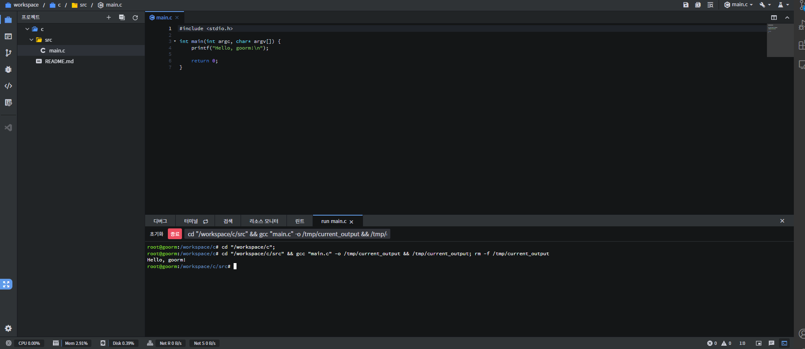

# 구름 IDE(goormide), 실습 환경 구축

실습 환경을 제공해주고, 협업툴로도 사용가능한 goormide의 사용 모습이다.
- 주소: https://ide.goorm.io/

무료 버전에서는
- 컨테이너(실습환경) 5개
- 동시실행 1개
- 항상 켜두기 1개
- gpu/주 30시간

이 사용가능하며 결제에 플랜에 따라 최대
- 컨테이너 20개
- 동시실행  4개
- 항상 켜두기 2개
- 저장공간 40GB/컨테이너

등을 제공한다

aws도 프리티어를 통해 무료로 사용할 수 있는 방법이 있지만,
[참고](https://aws.amazon.com/ko/premiumsupport/knowledge-center/what-is-free-tier/)

훨씬 간단하고 설정에 따른 추가요금에 대한 걱정이 없다는 점에서 재미있게 사용할 수 있겠다.